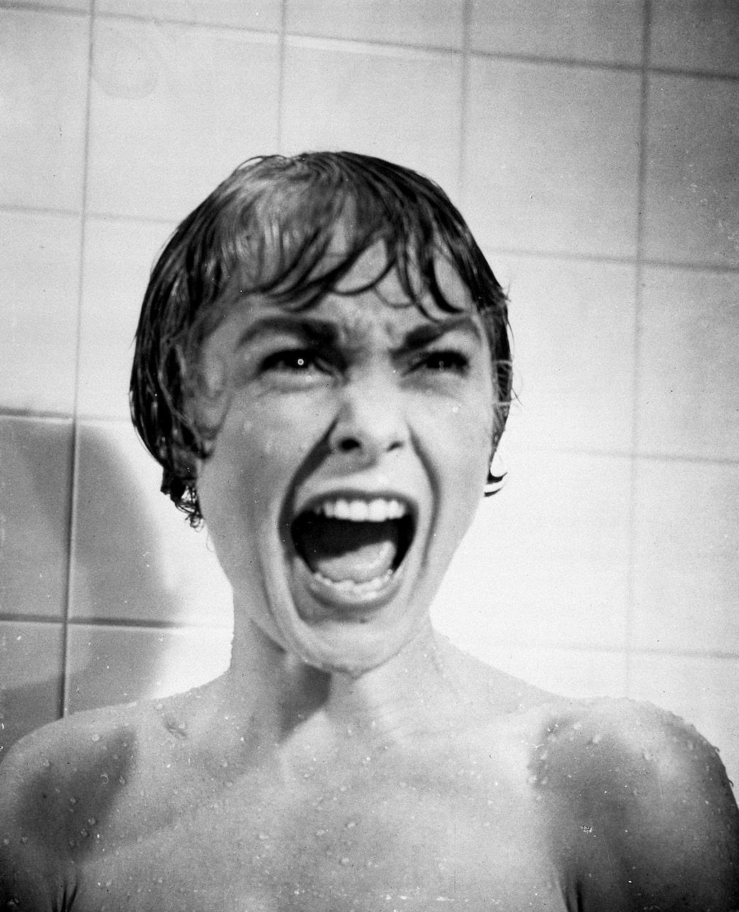
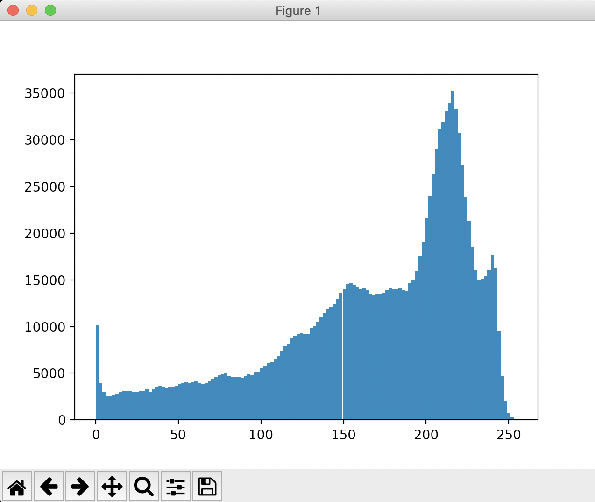
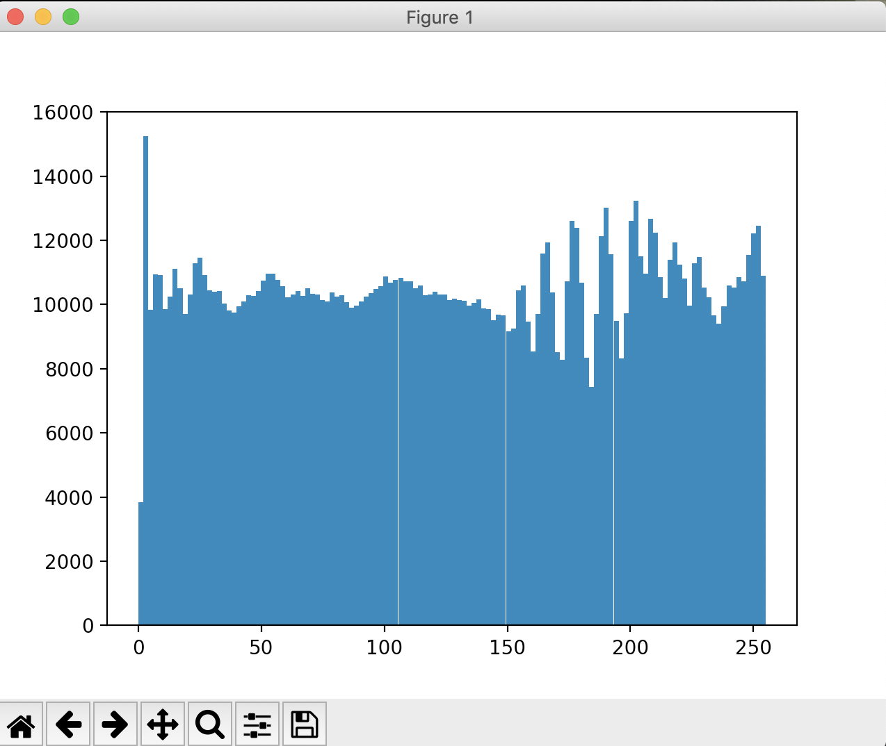
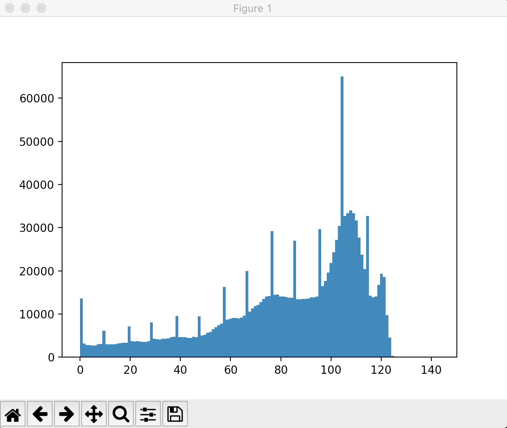

本项目使用java基础库实现了以下功能：

1.读取原始一张图像并在利用JFrame在窗口中展示，若该图像为彩色图则将其转换为灰度图并存储到指定目录。

原理为根据原图的rgb的值计算出灰度值grayVal，灰度图的rgb三个字节的值均为grayVal。

```java
int gray = (int) (0.3 * r + 0.59 * g + 0.11 * b);
rgb = 0xff << 24 | gray << 16 | gray<<8 | gray;
grayImage.setRGB(i,j,rgb);
```

下图为原始输入图片



像素分布如下：



2.将灰度进行直方图均衡，并将均衡处理后的图像存储到指定目录。

直方图均衡原理为：对原始图像的像素灰度做某种映射变换, 使变换后图像灰度的概率密度呈均匀分布。这就意味着图像灰度的动态范围得到了增加, 提高了图像的对比度。

具体算法为：

（1）统计原图片像素灰度分布

```java
int[] count = new int[256];
for(int i=0;i<grayImage.getWidth();i++) {
    for(int j=0;j<grayImage.getHeight();j++) {
        count[grayImage.getRGB(i,j)&0xff]++;
    }
}

double[] histogram = new double[256];
int N = grayImage.getHeight() * grayImage.getWidth();
for(int i=0;i<count.length;i++) {
    histogram[i] = (double)count[i] / N;
}
```

（2）均衡化处理

```java
for(int i=1;i<histogram.length;i++) {
    histogram[i] += histogram[i-1];
}
System.out.println(histogram[100]);
System.out.println(histogram[255]);
```

（3）求出图像新的灰度值

```java
BufferedImage outputImage = new BufferedImage(width,height,image.getType());

int grayVal,newVal;
for(int i=0;i<width;i++) {
    for(int j=0;j<height;j++) {
        grayVal = grayImage.getRGB(i,j)&0xff;
        newVal = (int)(histogram[grayVal]*255) & 0xff;
        outputImage.setRGB(i,j,0xff000000|newVal<<16|newVal<<8|newVal);
    }
}
```

效果展示如下：


像素分布如下：



可以看出均衡化处理后的图片的像素分布十分均匀。

3.由用户输入线性变换后的灰度值的最大和最小值，实现灰度拉伸并将处理后的图像存储到指定目录。

算法原理较为简单，只需将原图片的像素分布线性映射到[Min,Max]区间上即可。

代码实现为：

```java
for(int i=0;i<input.getWidth();i++) {
    for(int j=0;j<input.getHeight();j++) {
        val = input.getRGB(i,j)&0xff;
        val = (int)((max-min)/256*val+min);
        output.setRGB(i,j,0xff000000|val<<16|val<<8|val);
    }
}
```

Max =128 ,Min = 0时的效果如下：


验证像素分布：



可以看出像素分布被成功的映射到了我们指定的范围

4.为了方便显示修改图像后的像素分布，编写了一个简短的python脚本实现直方图展示功能。在命令行下运行该脚本，23中的直方图由该脚本可显示出来。

```python
from PIL import Image
from pylab import *

im = array(Image.open('/imagepath').convert('L'))

figure()
hist(im.flatten(),128)

show()
```